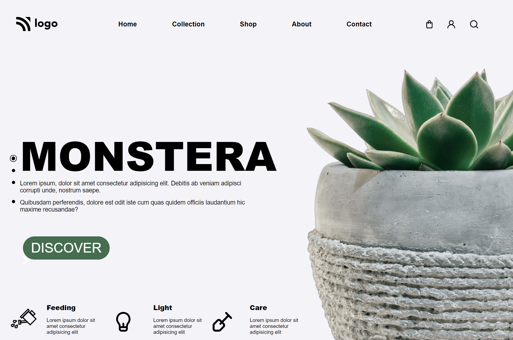

# Plant Health Website

## Time Taken - about 3.5 hours

 

An HTML & CSS based webpage.

 

 

## Flex

This was the first project that involved the use of `flex`. `Flex` was applied to the bottom-most 3 `div`s

 

## Position of Image

The main image of the potted plant was assigned `position: absolute`.

 

## List Item

The list bullet with the main heading was given custom `content` with a "⦿".
